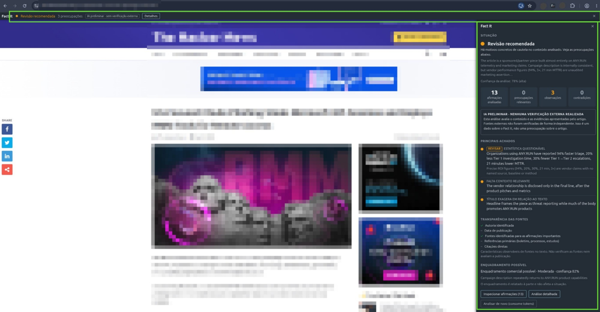
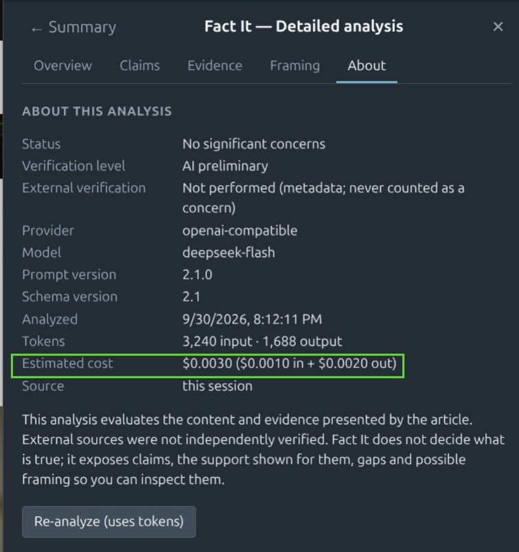
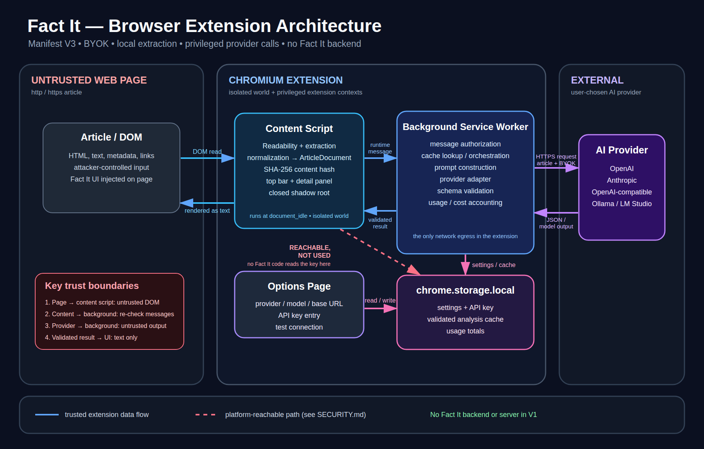

# Fact It

**Know what you're reading.** An open-source Chromium extension that
gives you a preliminary, AI-assisted read of the article in front of
you — using your own API key, with no Fact It servers in between.



Fact It looks for concrete signals that content may mislead: internal
contradictions, headlines the body does not support, allegations
presented as fact, misleading statistics, materially missing context
and unclear attribution.

It is **not a truth oracle** and it never consults external sources.
*No significant concerns* is a normal result — it means no warning
signals were found, not that the article is true. Fact It not having
verified something is never, by itself, a concern about the article.

## How it works

1. **You open an article.** The main text is extracted **locally**
   (Mozilla Readability) and a thin idle bar appears. Nothing has left
   your browser.
2. **You click Analyze.** The text goes straight from your browser to
   the provider you configured, with your key. Fact It runs no servers.
3. **The bar shows a status** — *No significant concerns*, *Review
   recommended* or *Significant concerns* — always labelled *AI
   preliminary · not externally verified*.
4. **Details** opens the summary, and from there the full analysis:
   claims, evidence, framing and the model/token/cost record.
5. **The result is cached** by a hash of the article text, so
   revisiting costs nothing. Re-analyze is always explicit.

→ [How to read a result](docs/READING_RESULTS.md) — what the statuses,
tags and labels do and do not mean.

## Install (developer preview)

Not on the Chrome Web Store yet.

1. Download `factit-<version>.zip` from the releases and unzip it, or
   clone this repository and use its `extension/` folder directly.
2. Open `chrome://extensions`, enable **Developer mode**, click **Load
   unpacked**, select the folder containing `manifest.json`.
3. Pin **Fact It** from the extensions menu.

Chrome, Chromium, Brave, Edge and other Chromium browsers (Manifest V3,
Chrome 116+).

## Configure a provider

Open **Options** (right-click the Fact It icon → Options):

| Provider | What to enter |
|---|---|
| **OpenAI** | API key. Defaults to `gpt-4o-mini`. |
| **Anthropic** | API key. Defaults to `claude-opus-5`; `claude-sonnet-5` is cheaper. |
| **OpenAI-compatible** | Base URL + model name, and a key if the server needs one. DeepSeek, Gemini, Mistral, xAI, Groq, OpenRouter, Moonshot, or a local Ollama / LM Studio. |

**Test connection** confirms it works. The key is stored in your browser
profile and never shown again; **Remove key** deletes it.

Keys, model names and base URLs for every supported provider:
[docs/PROVIDERS.md](docs/PROVIDERS.md).

**Interface language** (Automatic / English / Português) changes Fact
It's own text. The analysis itself follows the article's language.

## Costs

Each analysis sends the article (up to ~10k tokens) and receives JSON
(usually 1–3k). Nothing is sent on page load, on toolbar clicks, or
when a cached result exists. Use a key with a spending limit.

Enter your provider's price per 1M tokens in the settings and every
analysis shows what it cost, with a running total:



## Architecture



- **No Fact It backend.** Bring your own key; your content goes only to
  the provider you chose.
- **Permissions: `storage` only.** No host permissions, no web
  accessible resources, no telemetry, no accounts.
- **The page is untrusted** — article text is data, never instructions;
  model output is schema-validated and rendered as plain text in a
  closed shadow root.
- The dashed path is a Chromium platform property, not a Fact It data
  flow: `chrome.storage.local` is readable from any content script.
  No Fact It code reads the key there. See
  [SECURITY.md](SECURITY.md).

More: [ARCHITECTURE.md](ARCHITECTURE.md) · [PRIVACY.md](PRIVACY.md) ·
[DECISIONS.md](DECISIONS.md)

## Development

```bash
npm test            # unit tests
npm run test:smoke  # headless Chromium end-to-end
npm run package     # build the zip
```

See [docs/DEVELOPMENT.md](docs/DEVELOPMENT.md) for loading the unpacked
extension, the permission rationale and the test layout.
Releases: [docs/RELEASE.md](docs/RELEASE.md) ·
[CHANGELOG.md](CHANGELOG.md).

## Roadmap

Phase 1 Browser extension (this release) · Phase 2 Evidence Engine ·
Phase 3 Community · Phase 4 Reputation.
See [ROADMAP.md](ROADMAP.md) and [PLAN.md](PLAN.md).

## License

MIT — see [LICENSE](LICENSE). Bundles Mozilla Readability (Apache-2.0,
`extension/vendor/`).
